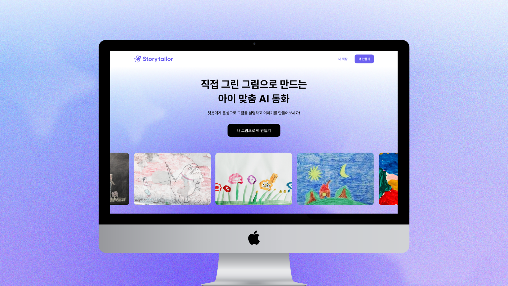

# 스토리 테일러 Story tailor

---

### 우리 아이가 그린 그림, 어떻게 관리하시나요?
이제 스토리 테일러와 함께 아이 그림을 아카이빙하고, 동화책도 만들어봐요! 🙌

### `🧑🏻‍🎨 오늘은 내가 동화책 작가!`

스토리 테일러는 가장 처음 접하는 가장 작은 사회인 가정에서부터 경험을 증진시키기위해 아이들의 콘텐츠에 주목했어요.

스토리 테일러를 통해 아이들은 이야기의 재단사가 될 수 있어요. 직접 그린 그림을 기반으로 동화책 제작의 처음부터 끝까지 참여할 수 있어요.

---

* 하단의 이미지는 연출된 이미지입니다.

### `Step 1`  그림 업로드

아이가 그린 그림을 **촬영 후** 스토리 테일러에 올려주세요.

생성형 AI가 그림을 분석해 **더 확장된 그림**을 제공해요!

**깨끗하게 촬영된 사진**이라면 더 명확한 그림을 얻을 수 있답니다.

### `Step 2-1`  챗봇과 대화 시작

그림이 업로드되면 **챗봇이 활성화**돼요!

`**이야기하기**`를 누르면 챗봇이 아이의 이야기를 경청한답니다!

### `Step 2-2`  질문에 답변하기

챗봇은 **각 질문당 1분 동안**의 이야기만 들을 수 있어요. 답변이 1분이 넘어가지않도록 주의해주세요!

챗봇의 질문에 대해 답변을 마쳤다면 다시 `**버튼**`을 눌러 답변이 끝났음을 알려주세요!

챗봇은 **총 5개의 질문**을 통해 동화책의 이야기를 파악해요.

### `Step 3`  추출된 단어

앞의 대화를 통해 **단어를 추출**해요!

원하는 단어를 `**추가**`할 수도 있고, 원하지 않는 단어를 `**제거**`할 수도 있어요!

### `Step 4`  지은이 입력

마지막으로 **동화책의 지은이**를 입력하면 동화책을 만들 모든 준비가 마무리돼요!

---

스토리 테일러는 아이와의 대화를 통해 **총 5장 분량**의 짧고 간단한 동화책을 만들어요.

또한 가장 첫번째 장에서 생성형 AI를 이용해 아이가 그림 **그림을 더 확장**하여 보여줘요.

아이와 함께 한 장 한 장 책장을 넘기며 아이의 상상력으로 만들어진 책을 감상해보세요!✨

---

* 하단의 이미지는 연출된 이미지입니다.

<aside>
💜 **현재 스토리 테일러가 제공하는 기능**

</aside>

> **그림 아카이빙**
> 

아카이빙 된 이미지를 바탕으로 이야기 생성 시, 업로드된 그림을 확장 및 재구성해요. 더 발전된 그림의 동화책 삽화로 아이들의 흥미를 유도할 수 있어요.

> **AI 음성 챗봇**
> 

아이와 음성으로 대화하며 그림에 대한 정보를 얻어요. 아이와의 대화를 텍스트로 변환하여 대화 후 관련 단어를 추출할 수 있어요.

> **동화책 생성**
> 

추출한 단어를 바탕으로 이야기를 생성하고, 생성된 이야기를 바탕으로 추가적인 삽화 이미지를 만들어 동화책을 완성해요!

> **동화책 번역**
> 

만들어진 동화책을 영어, 중국어, 일본어로 읽을 수 있도록 번역 기능을 개발하고 있어요!

<aside>
💚 **스토리 테일러가 준비하는 기능**

</aside>

> 단어 **퀴즈**
> 

동화책을 읽고 내용을 숙지했다면 단어 공부를 해볼까요? 동화책을 더 의미있게 활용할 수 있도록 단어 빈칸 퀴즈를 개발하고 있어요!

> **TTS 음성변환**
> 

직접 소리 내며 동화책을 읽어볼까요? 다양한 언어로 제공되는 만큼 교육의 도구로서 활용할 수 있도록 개발하고 있어요!

---

<aside>
🔔 **[출시 알림 신청하기](https://dwua5wsch38.typeform.com/to/VViT60Wv)**

</aside>

<aside>
🌐 **[베타 테스터 신청하기](https://dwua5wsch38.typeform.com/to/Lr36ycRX)**

</aside>

<aside>
📧 **문의 메일** 
storytailorshop@gmail.com

</aside>
